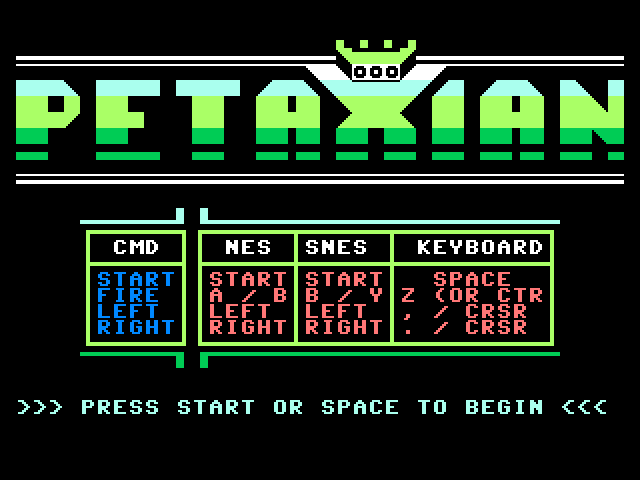
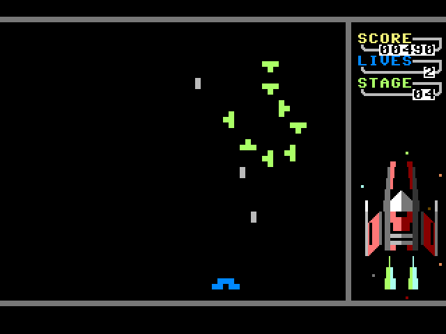

# Petaxian



This is a small project started to scrach muliple itches

- Doing something with the Commander X16 emulator (without having to work inside the emulator)
- Writing something low level without having to write things in assembly (at least for now)
- Test a new language (Prog8) found on the X16 pages

During the Covid lockdown I saw some good demos using C64 emulator and just PETSCII graphics and then
I remebered the old Galaga game on the C64. The one using just character graphics and thought
it would be interesting to test how difficult it would be to make something similar.



This is written in Prog8, see

- https://github.com/irmen/prog8
- https://prog8.readthedocs.io/en/latest/

The game is currently in "a sort of finished state" (i.e has a workable game loop) but may never end up 
completely polished. It's just a hobby project after all. I thought I had reach a point where most of what
I consider the fun stuff had been done but it turns out there are always a few more things to tinker with.
I still have a short list of features which may eventually be added.

Though I started working mostly with the X16 emulator, over time I've also focused on getting this to
run well on the C64. Various optimization of the code and some significant improvements in Prog8
now has the C64 running without noticable slowdowns.

Compile/run for Commander X16 with something like this
```
%JAVA_PATH% -jar prog8c-11.0.1-all.jar -srcdirs cx16 -target cx16 petaxian.p8

%X16EMU_PATH%\x16emu.exe -joy1 SNES -run -prg petaxian.prg
```
and for C64 with e.g.
```
%JAVA_PATH% -jar prog8c-11.0.1-all.jar -srcdirs c64 -target c64 petaxian.p8

%VICE_PATH%\x64sc.exe petaxian.prg
```

NB! The code is mostly in sync with the latest release version of the Prog8, so if you run into
problems make sure you download and test with the latest version of the compiler.

As of 2024-12-31 code has been updated to work with v11.0 of Prog8.

**Some recent addition include**

1. Added a few more enemy types, another bomb type and expanded/remixed to 20 stages
2. Showing single hiscore value (though display of this is ugly)
3. Added proper keyboard support for C64 (have not figured out to do that for CX16 yet)

**Even more recent news (2023-08-15)**

There is now a port of Petaxian for PET done by Milasoft (you can find this here https://milasoft64.itch.io/petaxian). This
was done based on the C64 assembly output and not in Prog8 which doesn't support PET yet (though possibly some support may
be coming in the near future).
